# Use Case Diagram - E-commerce Permata

## Use Case Diagram (Mermaid)

```mermaid
graph TB
    %% Actors
    Customer((Customer))
    Admin((Admin))
    Guest((Guest))
    System((System))
    
    %% Customer Use Cases
    Customer --> UC1[Register Account]
    Customer --> UC2[Login]
    Customer --> UC3[Browse Products]
    Customer --> UC4[Search Products]
    Customer --> UC5[View Product Details]
    Customer --> UC6[Add to Cart]
    Customer --> UC7[View Cart]
    Customer --> UC8[Update Cart]
    Customer --> UC9[Remove from Cart]
    Customer --> UC10[Proceed to Checkout]
    Customer --> UC11[Manage Profile]
    Customer --> UC12[View Order History]
    Customer --> UC13[Track Order Status]
    Customer --> UC14[Contact Support]
    Customer --> UC15[View FAQ]
    Customer --> UC16[Logout]
    
    %% Guest Use Cases
    Guest --> UC3
    Guest --> UC4
    Guest --> UC5
    Guest --> UC15
    Guest --> UC2
    Guest --> UC1
    
    %% Admin Use Cases
    Admin --> UC17[Admin Login]
    Admin --> UC18[Manage Products]
    Admin --> UC19[Manage Orders]
    Admin --> UC20[Manage Users]
    Admin --> UC21[View Dashboard]
    Admin --> UC22[Update Order Status]
    Admin --> UC23[Generate Reports]
    Admin --> UC24[Manage Categories]
    Admin --> UC25[View Analytics]
    Admin --> UC26[Manage Settings]
    Admin --> UC27[Admin Logout]
    
    %% System Use Cases
    System --> UC28[Send Order Confirmation]
    System --> UC29[Send Status Updates]
    System --> UC30[Process Payment]
    System --> UC31[Validate Inventory]
    System --> UC32[Calculate Totals]
    System --> UC33[Generate Invoice]
    
    %% Include Relationships
    UC10 -.-> UC30
    UC10 -.-> UC31
    UC10 -.-> UC32
    UC10 -.-> UC33
    UC10 -.-> UC28
    
    UC22 -.-> UC29
    
    %% Extend Relationships
    UC3 -.-> UC4
    UC5 -.-> UC6
    UC7 -.-> UC8
    UC7 -.-> UC9
    UC7 -.-> UC10
    
    %% Styling
    classDef actor fill:#e1f5fe,stroke:#01579b,stroke-width:2px
    classDef useCase fill:#f3e5f5,stroke:#4a148c,stroke-width:2px
    classDef system fill:#fff3e0,stroke:#e65100,stroke-width:2px
    
    class Customer,Guest,Admin actor
    class UC1,UC2,UC3,UC4,UC5,UC6,UC7,UC8,UC9,UC10,UC11,UC12,UC13,UC14,UC15,UC16,UC17,UC18,UC19,UC20,UC21,UC22,UC23,UC24,UC25,UC26,UC27 useCase
    class UC28,UC29,UC30,UC31,UC32,UC33 system
```

## Detailed Use Case Descriptions

### Customer Use Cases
1. **Register Account** - Customer creates new account with email, password, name, and phone
2. **Login** - Customer authenticates with email and password
3. **Browse Products** - Customer views product catalog with pagination
4. **Search Products** - Customer searches products by name, category, or price range
5. **View Product Details** - Customer sees detailed product information, images, and reviews
6. **Add to Cart** - Customer adds product to shopping cart with quantity
7. **View Cart** - Customer sees all items in shopping cart with totals
8. **Update Cart** - Customer modifies quantity of items in cart
9. **Remove from Cart** - Customer removes items from shopping cart
10. **Proceed to Checkout** - Customer completes purchase with shipping and payment info
11. **Manage Profile** - Customer updates personal information and preferences
12. **View Order History** - Customer sees list of past orders
13. **Track Order Status** - Customer checks current status of orders
14. **Contact Support** - Customer sends messages to customer service
15. **View FAQ** - Customer reads frequently asked questions
16. **Logout** - Customer ends session

### Admin Use Cases
17. **Admin Login** - Admin authenticates with admin credentials
18. **Manage Products** - Admin creates, updates, deletes, and manages product inventory
19. **Manage Orders** - Admin views and processes customer orders
20. **Manage Users** - Admin manages customer accounts and permissions
21. **View Dashboard** - Admin sees overview of sales, orders, and analytics
22. **Update Order Status** - Admin changes order status (pending, processing, shipped, delivered)
23. **Generate Reports** - Admin creates sales and inventory reports
24. **Manage Categories** - Admin manages product categories
25. **View Analytics** - Admin analyzes sales trends and customer behavior
26. **Manage Settings** - Admin configures system settings
27. **Admin Logout** - Admin ends session

### System Use Cases
28. **Send Order Confirmation** - System sends email confirmation to customer
29. **Send Status Updates** - System notifies customer of order status changes
30. **Process Payment** - System handles payment processing
31. **Validate Inventory** - System checks product availability
32. **Calculate Totals** - System calculates order totals including taxes and shipping
33. **Generate Invoice** - System creates invoice for completed orders 